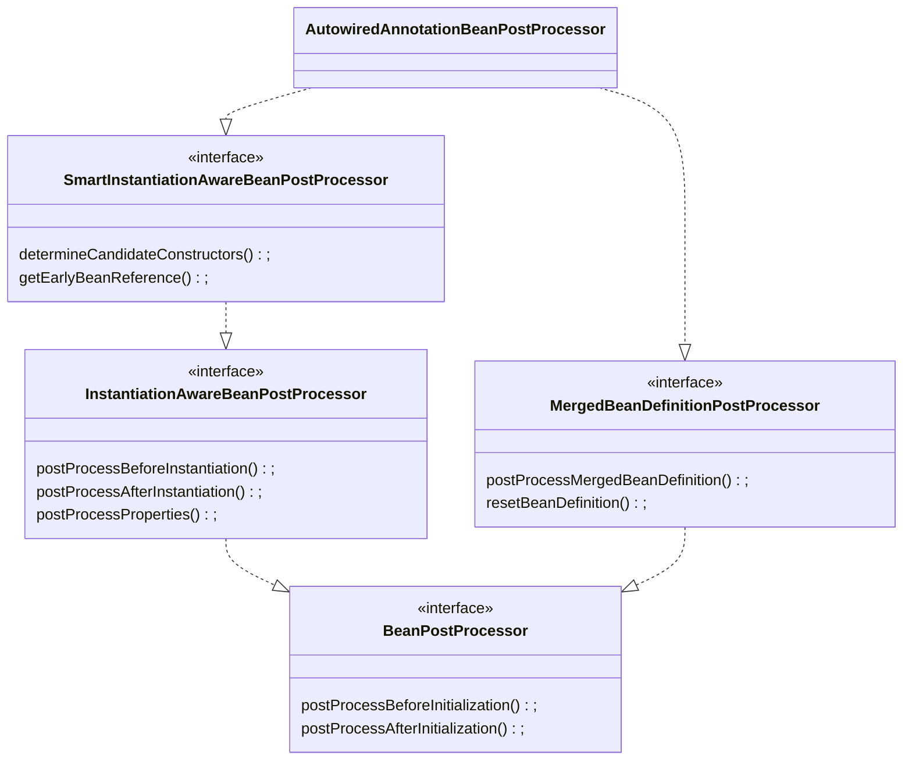

Spring 自从诞生以来就一直都是 Java 开发框架中的佼佼者，Spring 也是在各大面试中经常被提及的一个点，所以掌握 Spring 是无法避免的一道坎。而在 Spring 中最重要的就是 IOC 容器，IOC 管理着大量的 Bean。那么这些 Bean 仅仅是被 Spring 实例化出来管理那么简单吗？肯定不是的，在实例化 Bean 的过程中，Spring 提供了大量的扩展点供开发者去定制自己的 Bean，那么我们应该如何去扩展这些 Bean 就是本篇文章的重点。

# 后置处理器

后置处理器 —— `BeanPostProcessor` ，这是 Spring 为扩展 Bean 提供的接口。在 Spring 中，不管是内部提供的，还是开发者提供的后置处理器都是该接口的一个实现类。

```java
public interface BeanPostProcessor {

	@Nullable
	default Object postProcessBeforeInitialization(Object bean, String beanName) throws BeansException {
		return bean;
	}

	@Nullable
	default Object postProcessAfterInitialization(Object bean, String beanName) throws BeansException {
		return bean;
	}
}
```

该接口定义了两个方法，默认都是什么都不做，直接返回传入的 Bean。

其中 `postProcessBeforeInitialization()` 方法是在初始化 Bean 之前调用的，这里的初始化并不是指实例化，而是指这个 Bean 中定义的初始化回调方法，比如：`InitializingBean` 接口中的 `afterPropertiesSet()` 方法、`@PostConstruct` 修饰的方法。`postProcessBeforeInitialization()` 方法实在这些初始化回调方法执行之前执行。

而 `postProcessAfterInitialization()` 方法则是在初始化 Bean 之后调用。但是该方法在 `FactoryBean` 中也许会被执行两次，一次是因为 `FactoryBean` 本身执行的，另一个是因为 `FactoryBean` 创建的 Bean 执行的。后置处理器可以自行决定是否要为这两个 Bean 都执行该方法。

# 注册后置处理器

后置处理器在 Spring 中也是以 Bean 的形式存在的，所以后置处理器与我们放入 Spring 中的普通 Bean 并没有什么区别，都会被放入到 IOC 容器中进行管理。

那么 Spring 是在什么时候注册这些后置处理器的呢？我们自己又要怎么注册一个自定义的后置处理器呢？

首先来看第一个问题。Spring 是在什么时候注册了后置处理器？

Spring 在多个地方都有注册一些 `BeanPostProcessor`。第一个地方是在 `ApplicationContext` 的构造函数中：

```java
public AnnotationConfigApplicationContext(Class<?>... componentClasses) {
    // 在构造函数中，注册了 6 个 BeanDefinition:
    // 		1.ConfigurationClassPostProcessor
    // 		2.AutowiredAnnotationBeanPostProcessor
    //		3.CommonAnnotationBeanPostProcessor	支持 JSP-250 才会注册
    //		4.PersistenceAnnotationBeanPostProcessor 支持 Jpa 才会注册
    //		5.EventListenerProcessor
    // 		6.EventListenerFactory
    this();
    register(componentClasses);
    refresh();
}
```

在注释中有写出这里注册了 6 个 `BeanDefinition`，但是只有 2 - 4 才是真正的实现了 `BeanPostProcessor` 接口的后置处理器。注意这里仅仅是注册了 `BeanDefinition`，并不是真正实例化了这些后置处理器，这些后置处理器的实例化将会在后面进行。

真正注册这 3 个后置处理器的方法是：`registerAnnotationConfigProcessors()`。

```java
public static Set<BeanDefinitionHolder> registerAnnotationConfigProcessors(
      BeanDefinitionRegistry registry, @Nullable Object source) {

   DefaultListableBeanFactory beanFactory = unwrapDefaultListableBeanFactory(registry);
  
   Set<BeanDefinitionHolder> beanDefs = new LinkedHashSet<>(8);

    // 注册 AutowiredAnnotationBeanPostProcessor
   if (!registry.containsBeanDefinition(AUTOWIRED_ANNOTATION_PROCESSOR_BEAN_NAME)) {
      RootBeanDefinition def = new RootBeanDefinition(AutowiredAnnotationBeanPostProcessor.class);
      def.setSource(source);
      beanDefs.add(registerPostProcessor(registry, def, AUTOWIRED_ANNOTATION_PROCESSOR_BEAN_NAME));
   }

   // 只有符合 JSR-250 规范才会注册 CommonAnnotationBeanPostProcessor 
   if (jsr250Present && !registry.containsBeanDefinition(COMMON_ANNOTATION_PROCESSOR_BEAN_NAME)) {
      RootBeanDefinition def = new RootBeanDefinition(CommonAnnotationBeanPostProcessor.class);
      def.setSource(source);
      beanDefs.add(registerPostProcessor(registry, def, COMMON_ANNOTATION_PROCESSOR_BEAN_NAME));
   }

   // 只有检测到 JPA 的情况下才会注册 PersistenceAnnotationBeanPostProcessor
   if (jpaPresent && !registry.containsBeanDefinition(PERSISTENCE_ANNOTATION_PROCESSOR_BEAN_NAME)) {
      RootBeanDefinition def = new RootBeanDefinition();
      try {
         def.setBeanClass(ClassUtils.forName(PERSISTENCE_ANNOTATION_PROCESSOR_CLASS_NAME,
               AnnotationConfigUtils.class.getClassLoader()));
      }
      catch (ClassNotFoundException ex) {
         throw new IllegalStateException(
               "Cannot load optional framework class: " + PERSISTENCE_ANNOTATION_PROCESSOR_CLASS_NAME, ex);
      }
      def.setSource(source);
      beanDefs.add(registerPostProcessor(registry, def, PERSISTENCE_ANNOTATION_PROCESSOR_BEAN_NAME));
   }

   // 注册 EventListenerMethodProcessor
   if (!registry.containsBeanDefinition(EVENT_LISTENER_PROCESSOR_BEAN_NAME)) {
      RootBeanDefinition def = new RootBeanDefinition(EventListenerMethodProcessor.class);
      def.setSource(source);
      beanDefs.add(registerPostProcessor(registry, def, EVENT_LISTENER_PROCESSOR_BEAN_NAME));
   }

   return beanDefs;
}
```

第二、三个地方是在著名的 `Refresh()` 方法中，分别都已经进行了相关的注释。这里就不再贴出真正注册的那些语句了。

```java
public void refresh() throws BeansException, IllegalStateException {
   synchronized (this.startupShutdownMonitor) {
      // Tell the subclass to refresh the internal bean factory.
      ConfigurableListableBeanFactory beanFactory = obtainFreshBeanFactory();

      // 注册了三个 BeanPostProcessor：
      //    ApplicationListenerDetector
      //    ApplicationContextAwareProcessor
      //    LoadTimeWeaverAwareProcessor 满足指定条件才会注册
      prepareBeanFactory(beanFactory);

      try {
         // 注册了 1 个 BeanPostProcessor:
         //        ImportAwareBeanPostProcessor
         invokeBeanFactoryPostProcessors(beanFactory);

         // 注册了 1 个 BeanPostProcessor：
         // 	   ApplicationListenerDetector
         // 实例化 BeanPostProcessor:
         //        AutowiredAnnotationBeanPostProcessor
         //        CommonAnnotationBeanPostProcessor
         //        ApplicationListenerDetector
         //      ......
         // 注册的这些后置处理器必须是已经在上面的步骤中被转换为了 BeanDefinition
         // 否则将无法被成功注册，注册成功的后置处理器将会在实例化 Bean 的时候使用
         registerBeanPostProcessors(beanFactory);

         // 实例化非懒加载的单例对象
         finishBeanFactoryInitialization(beanFactory);
      }

      catch (BeansException ex) {
    
      }
   }
}
```

我们通过上面的代码可以知道注册的都是 `BeanPostProcessor` 的 `BeanDefinition`，这只是一个承载 Bean 属性的一个类，但是并不是我们真正需要的那个 Bean。所以，我们还需要通过这些 `BeanDefinition` 来实例化我们真正的后置处理器对象。而这个操作就是在 `registerBeanPostProcessors()`  这个方法中进行的。该方法通过调用 `getBean()` 方法来实例化后置处理器，然后将它放到容器中。

## 小结

Spring 内部自身总共注册了 7 个后置处理器，这是 Spring

| 后置处理器                             | 作用                                                         | 注册条件                                    |
| -------------------------------------- | ------------------------------------------------------------ | ------------------------------------------- |
| AutowiredAnnotationBeanPostProcessor   | 用于处理 @Autowired、@Value、@Inject、@LookUp                |                                             |
| CommonAnnotationBeanPostProcessor      | 用于处理 javax.annotation 包下的注解，如：@Resource。同时还可以处理 @WebServiceRef、@EJB | JSR-250支持                                 |
| PersistenceAnnotationBeanPostProcessor | 用于 JPA                                                     | JPA 支持                                    |
| ApplicationListenerDetector            | 检测 Bean 是否实现了 ApplicationListener 接口，如果有则将该 Bean 注册为监听器 |                                             |
| ApplicationContextAwareProcessor       | 执行 Bean 实现的 Aware 接口中的方法                          |                                             |
| LoadTimeWeaverAwareProcessor           | 检测 Bean 是否实现了 LoadTimeWeaverAware 接口，如果有则执行该接口下的方法 | 容器中需要包含名称为loadTimeWeaver的 Bean。 |
| ImportAwareBeanPostProcessor           | 该后置处理器有两个作用：一是检测 Bean 是否实现了 EnhancedConfiguration 接口，如果有则执行该接口下的方法；二是检测是否实现了 ImportAware 接口，如果有则执行该接口下的方法。 |                                             |

上面的 7 个后置处理器都是最终注册进容器的，但是它们本身并不仅仅是实现了 `BeanPostProcessor`，它们本身还会实现很多的其他 `BeanPostProcessor` 的子接口。

比如：`AutowiredAnnotationBeanPostProcessor`，它的 UML 图如下



通过 UML 图可以知道

 